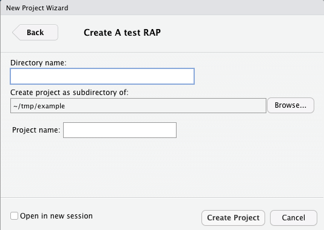

# Reproducible Analytical Pipelines in Rstudio

---

# Who am I?

- Data scientist at [Bennett Institute for Applied Data Science](https://www.bennett.ox.ac.uk/)
  *Pioneering the better use of data, evidence and digital tools in healthcare and policy*
    - Publish everything
    - Make collaboration easy
    - Automate tasks with code where possible
    - Use coders' best practice
- [OpenSAFELY](https://www.opensafely.org/about/): software platform for the analysis of electronic health record data
- See our [manifesto](https://docs.opensafely.org/open-data-manifesto/) for a good introduction to the principles of open science

---

# Who was I?

- Clinical Trials Statistician at [Scottish Clinical Trials Research Unit](https://beta.isdscotland.org/products-and-services/scottish-clinical-trials-research-unit-sctru/)
- Inspections are carried out by regulatory bodies
    - clear guidance on trial administration and record keeping
    - strong emphasis on audit trails and accountability
    - *BUT* no guidance on what is required for statistical work

- Legacy system: SPSS + copy/paste to Word
* :scream: :scream: :scream:

---

# Motivations

- Trial reports can be **very** long
- No regulatory guidance, so needed to document E V E R Y T H I N G
* Wanted to:
    - eliminate rerun anxiety
    - prioritise flexibility (because: analysis methodology changes)
    - maintain a methodology history (because: analysis methodology changes)
    - maintain an audit trail of decision making (because: humans forget)
    - learn something new

---

# Reproducible analytical pipelines

- Can reproduce an analysis, end-to-end
- Using version control (e.g., `git`) you have an audit trail 
- Becoming more common in civil service and government organisations
    - [UK government blog](https://dataingovernment.blog.gov.uk/2017/03/27/reproducible-analytical-pipeline/)
    - [Government Statistical Service](https://gss.civilservice.gov.uk/reproducible-analytical-pipelines)
    - [Office for National Statistics](https://datasciencecampus.ons.gov.uk/capability/data-science-campus-faculty/reproducible-analytical-pipeline-journey/) (includes links to courses on RAP subjects)

---

# Components

- Contained within a package (`organisationRAP`)

    1. Document templates/media 
    1. Build function for project
    1. Configuration of GUI interface between (i) and (ii)


---

## Component (i) Document templates/media

- Makes use of an R package's `inst/` directory ([more information here](https://r-pkgs.org/inst.html))
- Save a template pipeline directory here (e.g., `inst/resources`)


---

## Component (ii) Build function

- `R/TestProject.R`

    ```r
    TestProject <- function( path, name = "" ) {

        if (dir.exists(path)) {stop("This directory already exists")}

        ### generate the necessary directories
        dir.create(path, recursive = TRUE, showWarnings = FALSE)
        dir.create(...) # e.g., dat/ log/

        ### copy the template files - .Rmd, .R etc.
        # template_files = c()
        # for ( t in template_files ) { file.copy(t, file.path(path)) }

        ### copy directories files and contents - img/
        # for ( t in template_files ) { file.copy(t, file.path(path)) }
        # template_directories = c()
    }    
    ```


---


## Component (iii) GUI interface

- `inst/rstudio/templates/project/TestProject.dcf`

    ```yml
    Binding: TestProject
    Title: A test RAP

    Parameter: name
    Widget: TextInput
    Label: Project name
    ```

---

# What does this allow you to do?


---

# What does this allow you to do?

 

---

# Demo

Including a little bit of:
- package installation
- `bookdown` and `markdown`
- yaml tools

Explore my [CTutils package](https://github.com/LisaHopcroft/CTutils) for more information.

---

# Summary

- Spend time developing a robust RAP (it is worth it)
* Use `git` *properly* (i.e., branches + PRs, code review, issues, ...)
* Are you are copying and pasting? :loudspeaker: **YOU'RE DOING IT WRONG**
* Document, document, document (`roxygen2`)
* Testing :test_tube:
* Consider `renv` for package management